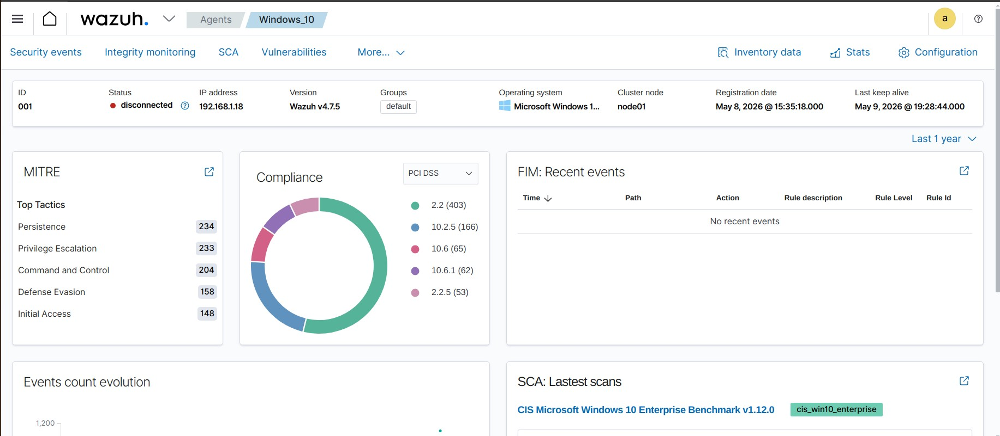
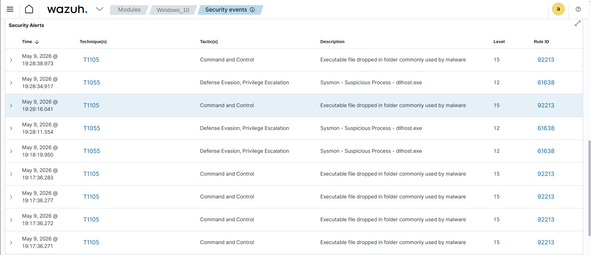
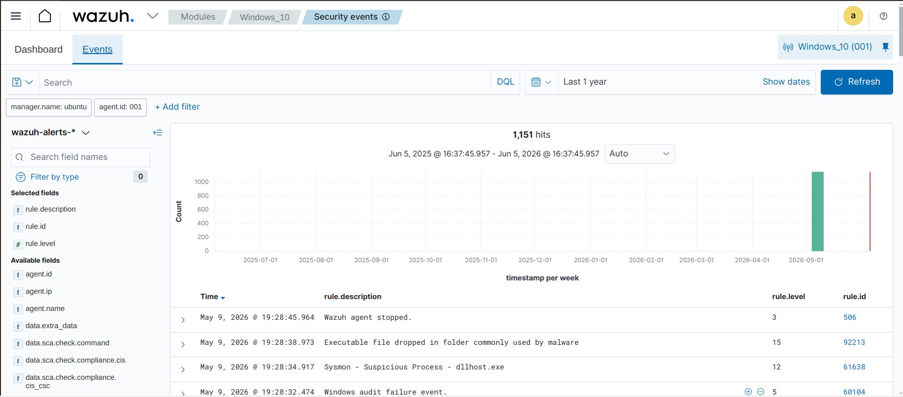

# Home SOC Lab using Wazuh, Sysmon, Windows & Kali Linux

## Overview

This project demonstrates the implementation of a Home Security Operations Center (SOC) Lab using Wazuh SIEM, Sysmon, Windows endpoints, and Kali Linux. The lab is designed to simulate real-world security monitoring, threat detection, log analysis, and attack investigation scenarios.

## Objectives

- Build a centralized security monitoring environment
- Collect and analyze Windows event logs
- Monitor PowerShell and process activity using Sysmon
- Simulate attacks using Kali Linux
- Investigate security alerts in Wazuh
- Understand MITRE ATT&CK techniques and mappings

---

## Lab Architecture

```
+----------------+
|   Kali Linux   |
| (Attacker VM)  |
+--------+-------+
         |
         |
         v
+----------------+
| Windows System |
| + Sysmon Agent |
+--------+-------+
         |
         |
         v
+----------------------+
|      Wazuh Server    |
| Manager + Dashboard  |
|      Ubuntu VM       |
+----------------------+
```

---

## Technologies Used

- Wazuh SIEM
- Sysmon
- Ubuntu Server
- Windows 10/11
- Kali Linux
- PowerShell
- VirtualBox
- MITRE ATT&CK Framework

---

## Features Implemented

### Log Collection
- Windows Event Logs
- Sysmon Event Logs
- Process Creation Events
- PowerShell Logs

### Threat Detection
- Encoded PowerShell Commands
- Discovery Commands
- Suspicious Process Execution
- Malware Activity Detection
- Security Event Monitoring

### Security Monitoring
- Real-time Alerting
- Endpoint Monitoring
- Event Correlation
- Threat Hunting

---

## Sysmon Integration

Configured Sysmon with SwiftOnSecurity configuration to generate detailed telemetry for:

- Process Creation
- Network Connections
- PowerShell Activity
- File Creation Events
- Registry Modifications

Added Sysmon log collection in Wazuh Agent configuration:

```xml
<localfile>
  <location>Microsoft-Windows-Sysmon/Operational</location>
  <log_format>eventchannel</log_format>
</localfile>
```

---

## Attack Simulations Performed

### Discovery Commands

```powershell
whoami
systeminfo
tasklist
net user
arp -a
```

### PowerShell Activity

```powershell
powershell -enc ZQBjAGgAbwAgAHQAZQBzAHQA
```

### Network Reconnaissance

```bash
nmap -A <target-ip>
```

---

## Sample Detections

- PowerShell Execution
- Encoded PowerShell Commands
- System Discovery Activities
- Process Creation Monitoring
- Network Reconnaissance
- Malware-Related Events

---

## Key Learning Outcomes

- SIEM Deployment and Configuration
- Endpoint Monitoring
- Log Analysis
- Threat Hunting
- Security Event Investigation
- MITRE ATT&CK Mapping
- Blue Team Operations
- SOC Analyst Workflow

---

## Screenshots

### Wazuh Dashboard



 



 



 

---

## Future Improvements

- Integrate Suricata IDS
- Add Sigma Rules
- Implement Custom Detection Rules
- Integrate TheHive for Incident Response
- Build Automated Alerting Workflows

---

## Author

Parthiv Lalakiya

Cybersecurity Enthusiast | SOC Analyst Aspirant
